# O2OA 企业信息化办公平台 Android端源码


O2OA 平台Android客户端，最低支持Android版本4.4 Android KitKat，编程语言主要使用kotlin。


## 环境安装

请使用最新版本的`Android Studio`进行导入编译，编译的Android SDK版本是 28。 `Android Studio`下载地址https://developer.android.google.cn/studio/


安装Android Studio完成后，打开设置里面的SDK Manager工具。

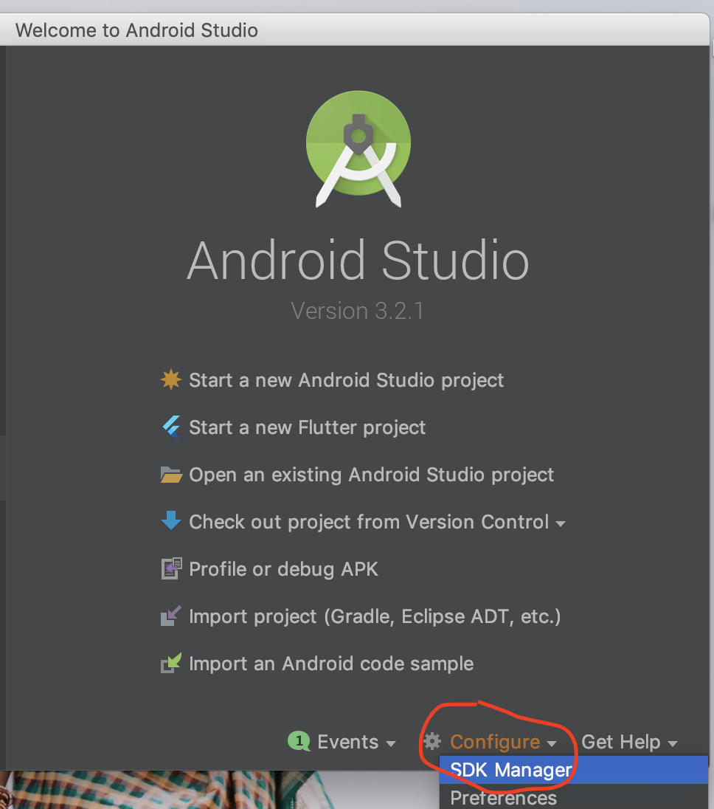

选择**Android 9.0 (Pie)** ，安装SDK。

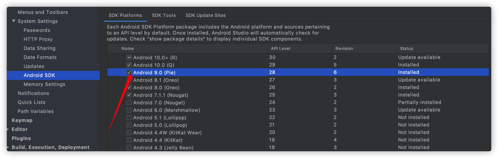

然后选择SDK Tools 选项卡，勾选右下角的Show Package Details，然后选择Android SDK Build-Tools 下面的**28.0.3**版本进行安装。


## 导入项目

打开`Android Studio` 点击`Open an existing Android Studio project`


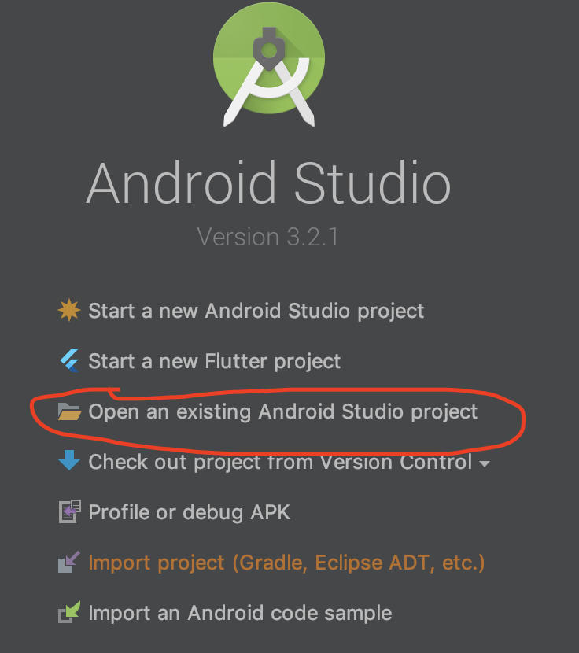


等它加载完成后可能会弹出这样一个窗口，让你更新gradle版本，这个不需要更新，点击 `Donot remind me again for this project`


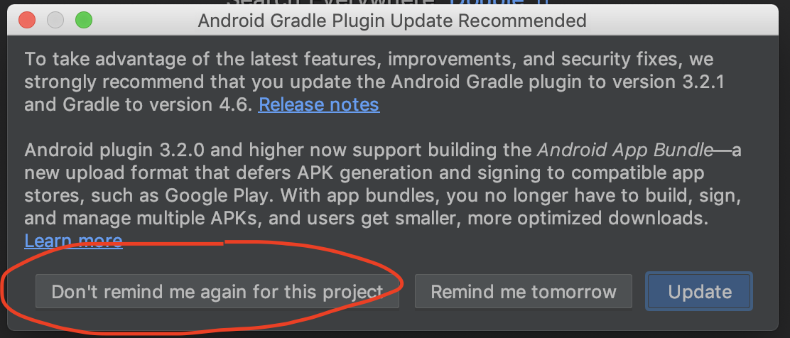


## 项目基本信息修改

### 项目名称

项目名称就是Android手机桌面上显示的名称，这个名称修改是在strings资源文件中：

具体位置：`./app/src/main/res/values/strings.xml`


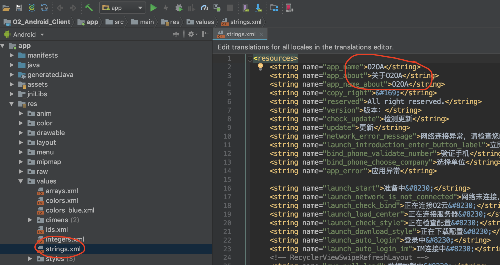


### 项目桌面LOGO

还有就是项目的LOGO，这个LOGO是在Android手机桌面上显示那个图标，这个需要替换图片： 图片位置： `./app/src/main/res` 这个资源目录下有4个 `mipmap` 文件夹，把4个文件夹中的`logo.png`和`logo_round.png`都替换了。


|                                                              |                                                              |
| ------------------------------------------------------------ | ------------------------------------------------------------ |
| 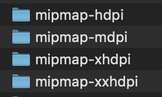 |  |


### 唯一应用ID


Android应用都有一个唯一的应用ID `applicationId` 。这个id代表这个Android App所以不能重复，一般都用公司域名组成的一串字符串，如： `com.baidu.app.xxx` 。 修改的文件是在`./app/build.gradle` 文件中，android -> defaultConfig -> applicationId 。

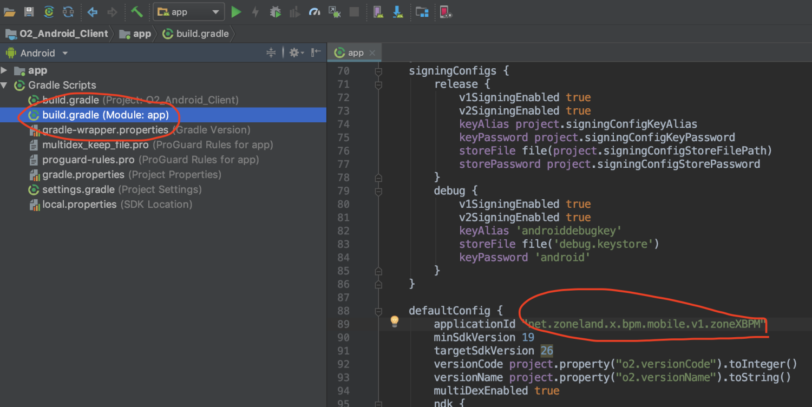


## 第三方SDK配置

找到项目根目录下的 `local.properties` 文件，里面有一些第三方SDK的key需要配置。

\# 下面是第三方SDK 需要的key

\# 极光推送

JPUSH_APPKEY_DEBUG=极光推送AppKey

\#百度语音

BAIDU_SPEECH_APPID=百度语音AppId

BAIDU_SPEECH_SECRET=百度语音Secret

BAIDU_SPEECH_APPKEY=百度语音Appkey

\#百度地图

BAIDU_MAP_APPKEY=百度地图Appkey

\#腾讯bugly

BUGLY_APPID=腾讯Bugly AppId


在`local.properties`文件中还有打包签名证书的信息需要配置，如果用Android studio打包，这几个参数可为空：

```
signingConfig.keyAlias=密钥别名
signingConfig.keyPassword=密码
signingConfig.storeFilePath=密钥文件
signingConfig.storePassword=存储密码
```

 

## 直连版本配置 

如果你不希望连接到我们O2云，通过修改配置编译打包，生成的Android应用，就会直接连接到你们自己的O2OA服务器。 

直连版本的极光消息推送需要额外配置：[《O2OA移动端APP直连版本如何开启消息推送》](https://www.yuque.com/docs/share/d9b8e231-bfcc-48cf-a671-141fd927f78f?# 《O2OA移动端APP直连版本如何开启消息推送》)

修改方式如下： 在app目录下的build.gradle文件中，找到 android -> buildTypes ，把`InnerServer` 改成 `true` 。这里应用有两个 一个debug下的 一个是release下的

buildConfigField "Boolean", "InnerServer", "true"

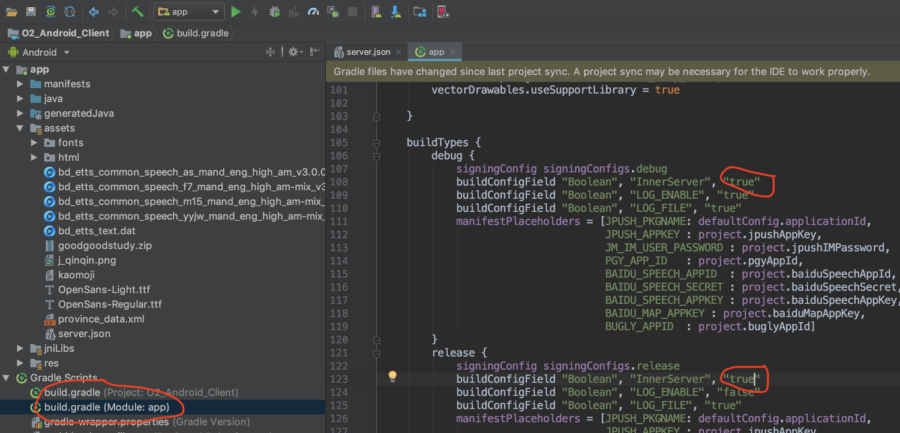

然后找到app->assets 目录下找到server.json文件，把里面的centerHost 、 centerPort、httpProtocol改成你们自己的O2OA中心服务器地址信息。

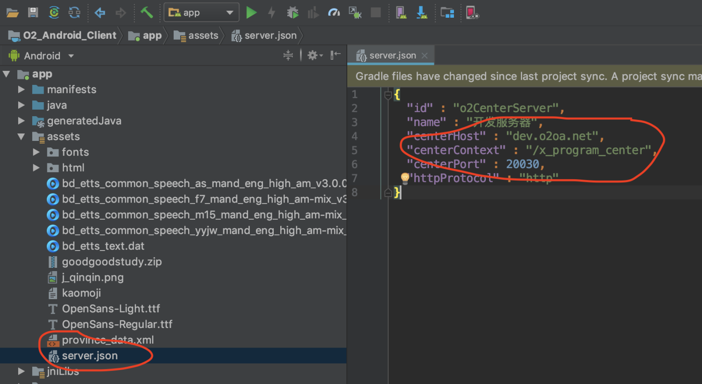


## 打包Android apk

打包还是通过Android Studio工具。上面提到的生成签名文件的时候一样，找到菜单 Build -> Generate Signed Bundle or APK 。


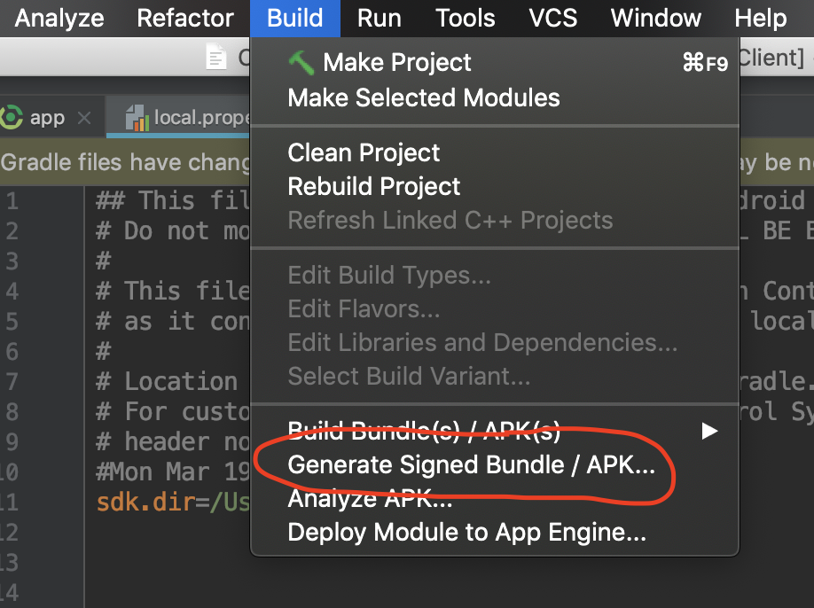


然后勾选APK ，下一步。 


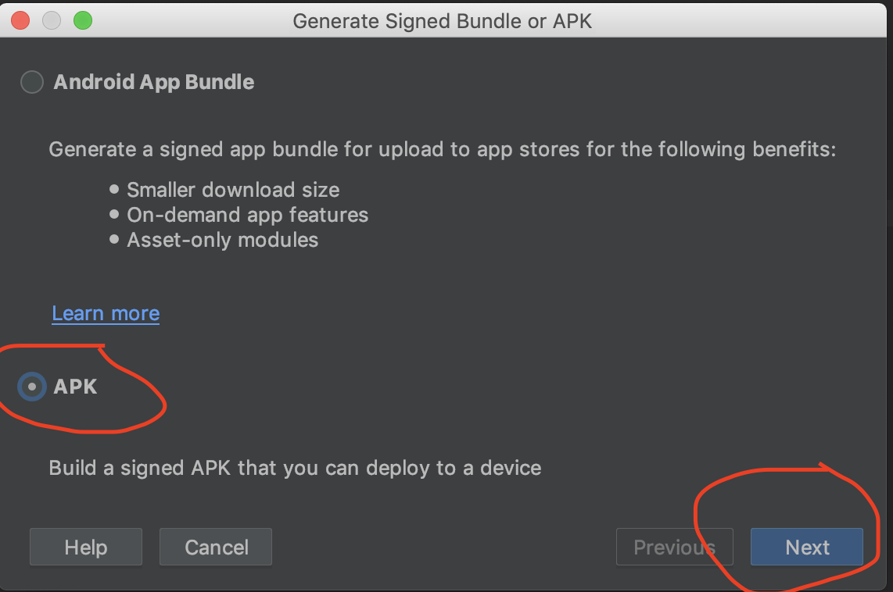


这次不用新建了因为刚才已经创建好签名文件了，选择你刚才生成的签名文件，输入密码，然后继续。 


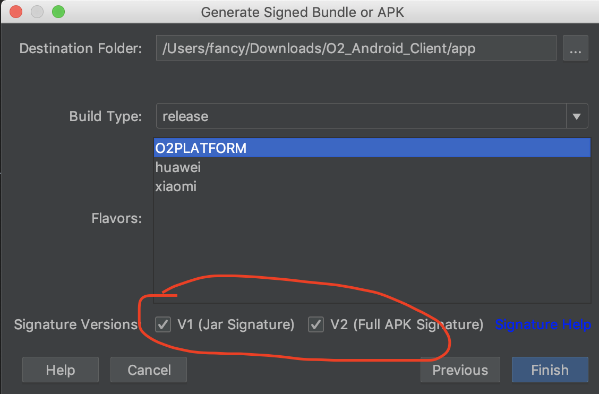

这里的签名版本V1和V2都勾选。点击 `Finish` 就开始打包了。 打包完成后，APK文件在 `./app/O2PLATFORM/release/` 目录下 。


# 协议

[AGPL-3.0 开源协议。](./LICENSE)


# 关于

[](./img/O2OA-logo.jpg)


O2OA开发平台是由 **浙江兰德纵横网路技术股份有限公司** 建立和维护的。O2OA 的名字和标志是属于 **浙江兰德纵横网路技术股份有限公司** 的注册商标。

我们 ❤️ 开源软件！看一下[我们的其他开源项目](https://github.com/o2oa)，瞅一眼[我们的博客](https://my.oschina.net/o2oa)。